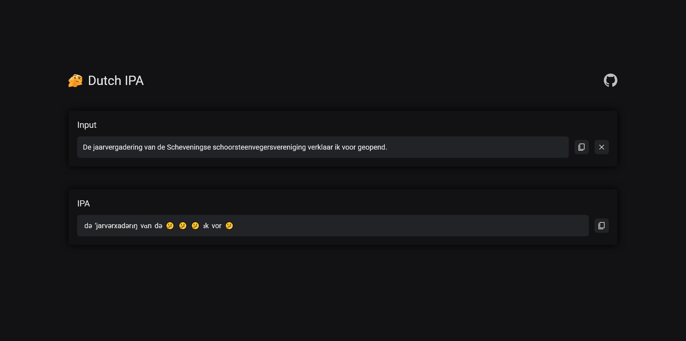

# Dutch-ipa

[](https://fresh.deno.dev)

Try it now! [https://dutch-ipa.deno.dev/](https://dutch-ipa.deno.dev/)

A website that shows you the IPA transcription of a Dutch sentence.



## Features

- IPA transcription for every single word
- Translation into another language (coming soon)
- Pronunciation of the sentence (planned)

## Installation

0. Requirements:

- [Deno](https://deno.land/)
- [SASS](https://sass-lang.com/)
- an internet connection (for the backend to fetch the pronunciations)
- a Redis database

1. Clone the repository:

```bash
git clone https://github.com/Ascor8522/dutch-ipa.git
cd dutch-ipa
```

2. Set the environment variables:

Copy the `.env.example` file to `.env` and fill in the required values.

The credentials are for a **Redis database**.

## Usage

### Development

1. Start the compilation of SASS:

```bash
deno task sass
```

This will watch the SCSS files re-compile as necessary (only the `static/style.scss` file is watched).

2. Start the dev server:

```bash
deno task start
```

This will watch the project directory and restart the dev server as necessary.

### Production

1. Build the SASS files (see previous section)

2. Build the project (see previous section)

You must have run the project in development mode at least once to build the application (generate routes).

3. Start the server:

```bash
deno run -A main.ts
```

## FAQ

### There is sometimes a thinking emoji (🤔) in the IPA transcription

> This means that no IPA transcription has been found for the corresponding word.

### There are errors in the IPA transcription

> This is because of how the source of data we use works. When a verb is conjugated, or when a word is in plural, the source redirects to the base form of the word.
>
> I am aware of this and am working on a solution.

### What source of data do you use?

> For the IPA:
> - Dutch:
>	- [Woorden.org](https://www.woorden.org/)
>	- [Dutch Wiktionary](https://nl.wiktionary.org/) (planned, as backup)
> For the translation:
> - [Google Translate](https://translate.google.com/)
> Pronunciation:
> - [Google Translate](https://translate.google.com/)

### Are you going to add more languages?

> Eventually, yes.
